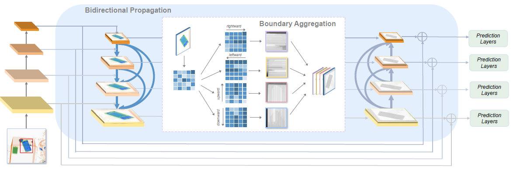
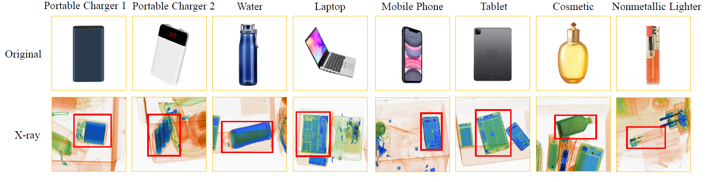
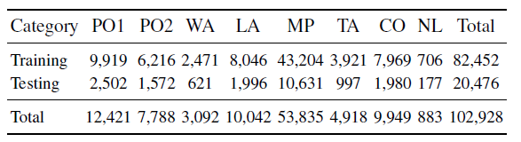
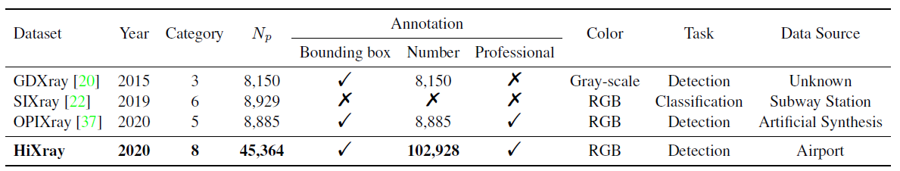
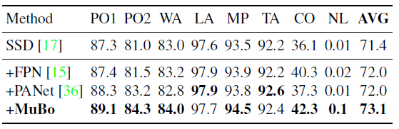

# [High-quality X-ray Security Inspection Benchmark and Multi-directional Boundary Intensification Model for Prohibited Items Detectio]

This repository is the official **HiXray dataset**.

#### MuBo framework:

#### HiXray dataset:

    

## Table of Contents

- [Overview](#overview)
- [Dataset](#dataset)
- [Install](#install)
- [Results](#results)
- [Acknowledgement](#Acknowledgement)  
- [License](#license)

## Overview

Prohibited items detection in X-ray images often plays an important role in protecting public safety, which often deals with color-monotonous and luster-insufficient objects, resulting in unsatisfactory performance. Till now, there have been rare studies touching this topic due to the lack of specialized high- uality datasets. In this work, we first present a High-quality X-ray Security Inspection (HiXray) image dataset, which contains 102,928 common prohibited items of 8 categories. It is the first high-quality dataset for prohibited items detection, gathered from the real-world airport security inspection and annotated by professional security inspectors. Besides, we find that the boundary in X-ray images provides strongly discriminative information for accurate object detection, especially when objects are overlapped and occluded with each other. We further propose Multidirectional Boundary Intensification (MuBo) model, which intensifies the boundary feature by Bidirectional Propagation across network layers, and Boundary Aggregation inside each network layer. Specifically, Bidirectional Propagation maximizes the boundary information flowing by a dense mechanism bidirectionally and Boundary Aggregation captures the fine-grained boundary information from four directions. MuBo is versatile and can be applied to the SOTA detection approaches. We evaluate it extensively on HiXray and OPIXray dataset and the results demonstrate that our approach improves SOTA detection methods.

## Dataset

In this project, we build the largest High-quality X-ray Security Inspection dataset.

- All images of HiXray dataset are annotated manually by professional inspectors from an international airport, and the standard of annotating is based on the standard of training security inspectors.

- HiXray dataset contains a total of 45364 X-ray images(36295 for training, 9069 for testing), including 8 categories of cutters, namely, 'Portable_Charger_1','Portable_Charger_2','Mobile_Phone','Laptop','Tablet','Cosmetic','Water','Nonmetallic_Lighter'

	

	    
	

- The information structure of annotation file is as follows: 
	image name, category, top-left position of prohibited item (x1, y1), bottom-right position of prohibited item (x2, y2).
	
- Comparison of existing open-source X-ray datasets:
	

	    
	

## Install
1. Access HiXray dataset

	HiXray dataset is available only for ACADEMIC PURPOSE, if you are interested in our dataset, feel free to contact rstao@buaa.edu.cn.
## Results
Comparing with Feature Pyramid Mechanisms:

    

Visualization of the performance of both the baseline SSD and the MuBo-integrated model:

    

## License

The images and the corresponding annotations in HiXray Dataset can be used **ONLY for academic purposes**, **NOT for commercial purposes**. 

Copyright © 2020 by State Key Lab of Software Development Environment, Beihang University

All rights reserved.
