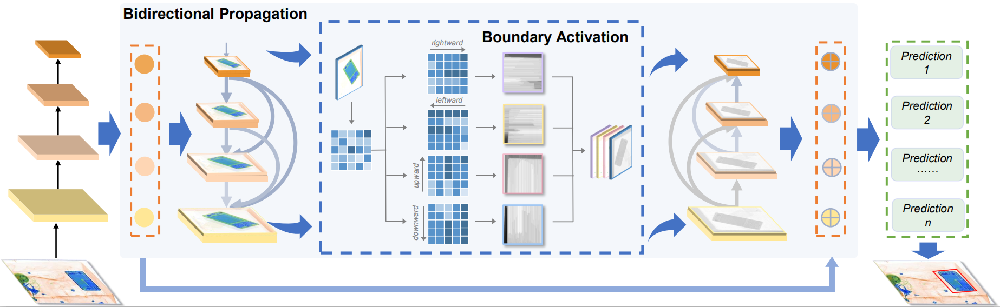

# [Towards]

This repository is the official **HiXray dataset**.

#### HiXray dataset:

<div align=center>
    
</div>

#### LIM framework:




## Table of Contents

- [Overview](#overview)
- [Dataset](#dataset)
- [Install](#install)
- [Results](#results)
- [Acknowledgement](#Acknowledgement)  

## Overview

Prohibited items detection in X-ray images often plays an important role in protecting public safety, which often deals with color-monotonous and luster-insufficient objects, resulting in unsatisfactory performance. Till now, there have been rare studies touching this topic due to the lack of specialized high-quality datasets. In this work, we first present a High-quality X-ray (HiXray) security inspection image dataset, which contains 102,928 common prohibited items of 8 categories. It is the largest dataset of high quality for prohibited items detection, gathered from the real-world airport security inspection and annotated by professional security inspectors. Besides, for accurate prohibited item detection, we further propose the Lateral Inhibition Module (LIM) inspired by the fact that humans recognize these items by ignoring irrelevant information and focusing on identifiable characteristics, especially when objects are overlapped with each other. Specifically, LIM, the elaborately designed flexible additional module, suppresses the noisy information flowing maximumly by the Bidirectional Propagation (BP) module and activates the most identifiable charismatic, boundary, from four directions by Boundary Activation (BA) module. We evaluate our method extensively on HiXray and OPIXray and the results demonstrate that it outperforms SOTA detection methods.

## Dataset

In this project, we build the largest High-quality X-ray Security Inspection dataset.

- All images of HiXray dataset are annotated manually by professional inspectors from an international airport, and the standard of annotating is based on the standard of training security inspectors.

- HiXray dataset contains a total of 45364 X-ray images(36295 for training, 9069 for testing), including 8 categories of cutters, namely, 'Portable_Charger_1','Portable_Charger_2','Mobile_Phone','Laptop','Tablet','Cosmetic','Water','Nonmetallic_Lighter'

	<div align=center>
	    
	</div>

- The information structure of annotation file is as follows: 
	image name, category, top-left position of prohibited item (x1, y1), bottom-right position of prohibited item (x2, y2).
	
- Comparison of existing open-source X-ray datasets:
	<div align=center>
	    
	</div>
## Install
1. Access HiXray dataset

	HiXray dataset is available only for ACADEMIC PURPOSE, if you are interested in our dataset, feel free to contact rstao@buaa.edu.cn.
2. If you want to train your model, execute the following command:
   change root to `MuBo`
   ```
   cd MuBo
   ```

   Change the value of HiXray_ROOT variable in MuBo/data/HiXray.py file to the path where the training set is located, for example, 
   ```
   HiXray_ROOT = "/mnt/cvpr_dataset/train/"
   ```
   run `train.py`
   ```
   python train.py --save_folder /mnt/model/Mubo/save/ --image_sets /mnt/cvpr_dataset/train/train_name.txt --transfer /mnt/ssd300_mAP_77.43_v2.pth
   ```
   **save_folder** is used to save the weight file obtained by training the model, 

   **image_sets**  is the path to a TXT file that saves all the picture names used for training, 

   **transfer** indicates the pre-trained weight of SSD on VOC0712 (available at [here](https://s3.amazonaws.com/amdegroot-models/ssd300_mAP_77.43_v2.pth)).

3. If you want to test our model, execute the following command:
   change root to `MuBo`
   ```
   cd MuBo
   ```

   Change the value of HiXray_ROOT variable in MuBo/data/HiXray.py file to the path where the testing set is located, for example, 
   ```
   HiXray_ROOT = "/mnt/cvpr_dataset/test/"
   ```
   run `test.py`
   ```
   python test.py --trained_model /mnt/model/Mubo/weights/Mubo.pth --imagesetfile /mnt/cvpr_dataset/test/test_name.txt
   ```

   **trained_model** is the weight file you want to test, our model is available at [here](https://pan.baidu.com/s/1hCIe--hGCVjphceiUnKm0A), password is ectq

## Results
Comparing with Feature Pyramid Mechanisms:

<div align=center>
    
</div>

Visualization of the performance of both the baseline SSD and the MuBo-integrated model:

<div align=center>
    
</div>


