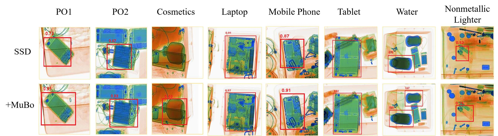

# [Towards]

This repository is the official **HiXray dataset**.
#### HiXray Dataset Download Link
Please go to the [webpage](https://github.com/DIG-Beihang/XrayDetection) and download according to the prompts.

#### HiXray dataset:

<div align=center>
    
</div>

#### LIM framework:


## Table of Contents

- [Dataset](#dataset)
- [Install](#install)
- [Results](#results)
- [Acknowledgement](#Acknowledgement)  


## Dataset
<!-- 
#### Download link
(China mainland, BaiduNetdisk) https://pan.baidu.com/s/1ugMhHtEp4G7yEF_WbLt8DA password: buaa

(Other area, Google Drive) https://drive.google.com/drive/folders/1zlDLw36SQp5Y9Oi-TzUmZc4zFKk6nHgW?usp=sharing
-->

In this project, we build the largest High-quality X-ray Security Inspection dataset.

- All images of HiXray dataset are annotated manually by professional inspectors from an international airport, and the standard of annotating is based on the standard of training security inspectors.

- HiXray dataset contains a total of 45364 X-ray images(36295 for training, 9069 for testing), including 8 categories of cutters, namely, 'Portable_Charger_1','Portable_Charger_2','Mobile_Phone','Laptop','Tablet','Cosmetic','Water','Nonmetallic_Lighter'

	<div align=center>
	    
	</div>

- The information structure of annotation file is as follows: 
	image name, category, top-left position of prohibited item (x1, y1), bottom-right position of prohibited item (x2, y2).
	
- Comparison of existing open-source X-ray datasets:
	<div align=center>
	    
	</div>
## Install
1. If you want to train your model, execute the following command:
   change root to `MuBo`
   ```
   cd MuBo
   ```

   Change the value of HiXray_ROOT variable in MuBo/data/HiXray.py file to the path where the training set is located, for example, 
   ```
   HiXray_ROOT = "/mnt/cvpr_dataset/train/"
   ```
   run `train.py`
   ```
   python train.py --save_folder /mnt/model/Mubo/save/ --image_sets /mnt/cvpr_dataset/train/train_name.txt --transfer /mnt/ssd300_mAP_77.43_v2.pth
   ```
   **save_folder** is used to save the weight file obtained by training the model, 

   **image_sets**  is the path to a TXT file that saves all the picture names used for training, 

   **transfer** indicates the pre-trained weight of SSD on VOC0712 (available at [here](https://s3.amazonaws.com/amdegroot-models/ssd300_mAP_77.43_v2.pth)).

2. If you want to test our model, execute the following command:
   change root to `MuBo`
   ```
   cd MuBo
   ```

   Change the value of HiXray_ROOT variable in MuBo/data/HiXray.py file to the path where the testing set is located, for example, 
   ```
   HiXray_ROOT = "/mnt/cvpr_dataset/test/"
   ```
   run `test.py`
   ```
   python test.py --trained_model /mnt/model/Mubo/weights/Mubo.pth --imagesetfile /mnt/cvpr_dataset/test/test_name.txt
   ```

   **trained_model** is the weight file you want to test, our model is available at [here](https://pan.baidu.com/s/1hCIe--hGCVjphceiUnKm0A), password is ectq

## Results
Comparing with Feature Pyramid Mechanisms:

<div align=center>
    
</div>

Visualization of the performance of both the baseline SSD and the MuBo-integrated model:

<div align=center>
    
</div>

## Citation
If this work helps your research, please cite the following paper.
```
@inproceedings{Tao:ICCV21,
  author    = {Renshuai Tao and Yanlu Wei and Xiangjian Jiang and Hainan Li and Haotong Qin and Jiakai Wang and Yuqing Ma and Libo Zhang and Xianglong Liu*},
  title     = {Towards Real-world X-ray Security Inspection: A High-quality Benchmark and Lateral Inhibition Module for Prohibited Items Detection},
  booktitle = {IEEE ICCV},
  year      = {2021},
  } 

```


